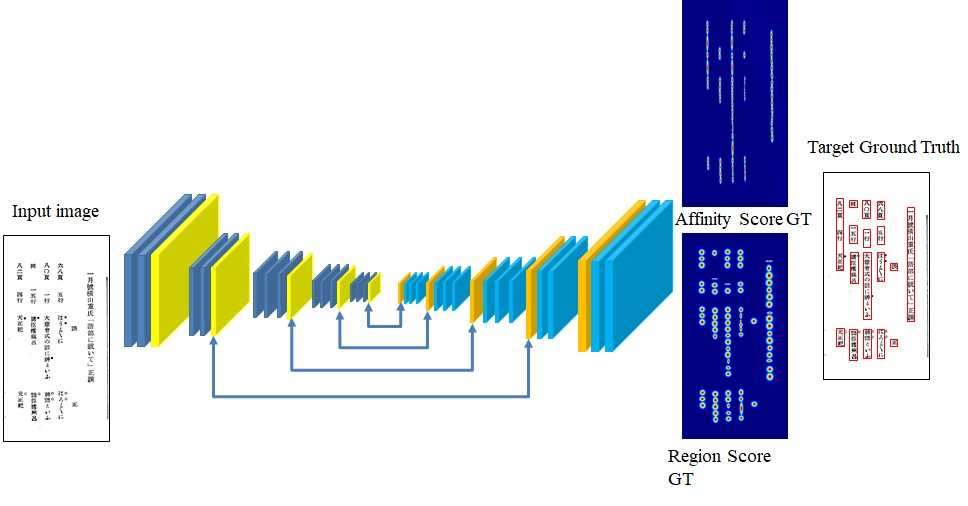
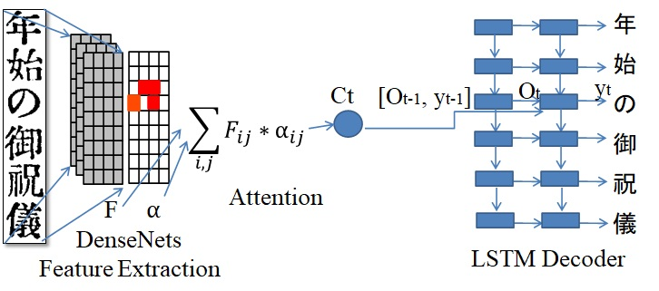
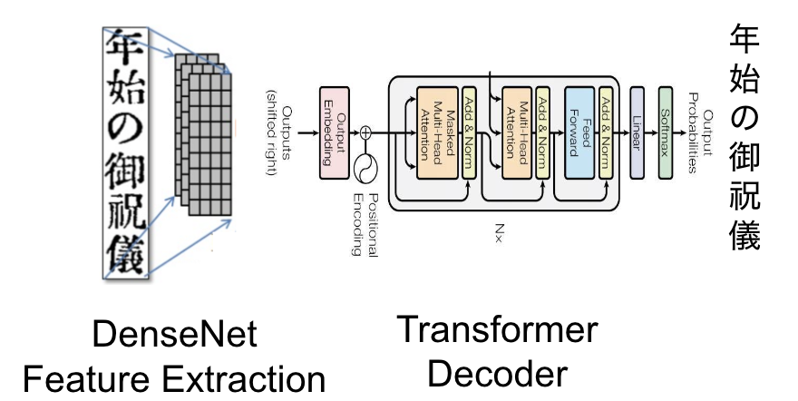
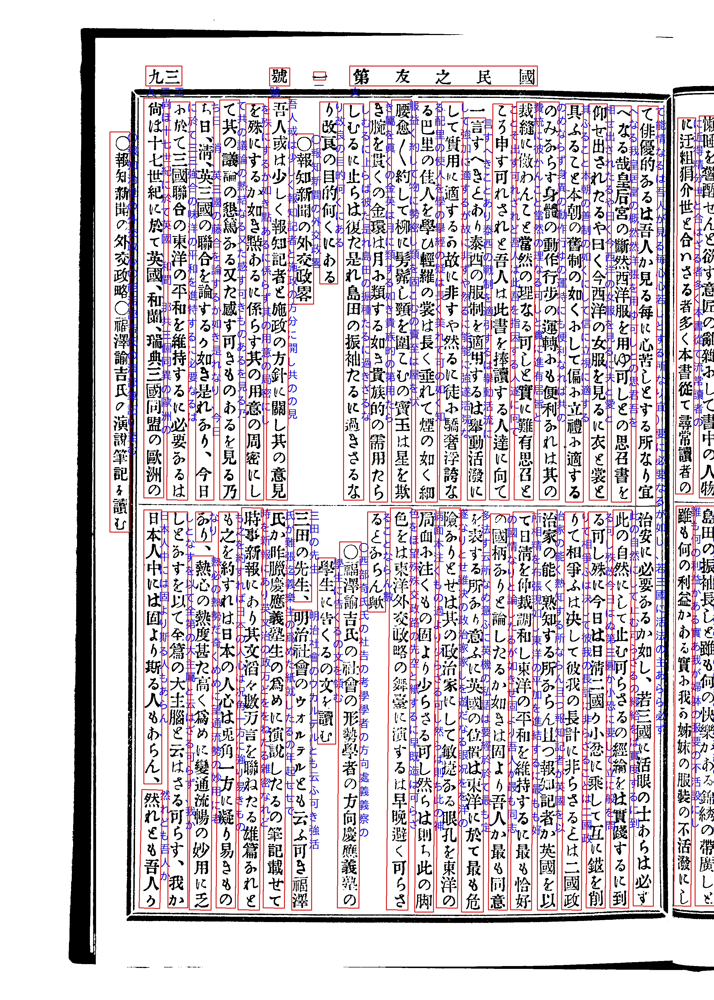

# Kindai-OCR
近代日本語雑誌を認識する OCR システム

# 更新履歴
Kindai V2.0 では、文字認識に Transformer OCR を採用しました。Transformer OCR は NDL と CODH のデータセットで学習しています。

## 概要

このリポジトリには、近代日本語の画像をテキストへ変換する OCR システムが含まれています。本ソフトウェアは、Anh Duc Le 博士が <a href="http://codh.rois.ac.jp/">ROIS-DS 人文学オープンデータ共同利用センター</a>在籍時に開発しました。

システムは、テキスト行抽出とテキスト行認識の 2 つの主要モジュールで構成されています。全体構成を以下の図に示します。

### テキスト行抽出
東京大学大学院教育学研究科附属学校教育高度化・効果検証センターから提供されたアノテーション付き画像 1,000 枚を使い、CRAFT (Character Region Awareness for Text Detection) を再学習しています。



### テキスト行認識
Kindai V1.0 では、過去の研究で使用した attention-based encoder-decoder を採用しています。東京大学大学院教育学研究科附属学校教育高度化・効果検証センターから提供されたアノテーション付き画像 1,000 枚と、国立国語研究所から提供された未アノテーション画像 1,600 枚を使ってテキスト行認識を学習しています。
    


Kindai V2.0 では、国立国会図書館 (NDL) と人文学オープンデータ共同利用センター (CODH) のより大規模なデータを使って Transformer を学習しました。
[NDL データセット](https://github.com/ndl-lab/pdmocrdataset-part2)には 3,997 ページ、103,256 行が含まれ、[CODH データセット](http://codh.rois.ac.jp/modern-magazine/dataset/)には 1,985 ページ、59,465 行が含まれています。

     



## Kindai OCR のインストール

```Python==3.7.11         
torch==1.7.0     
torchvision==0.8.1     
opencv-python==3.4.2.17     
scikit-image==0.14.2     
scipy==1.1.0     
Polygon3     
pillow==4.3.0     
pytorch-lightning==1.3.5     
einops==0.3.0     
editdistance==0.5.3
```  


## Kindai OCR の実行
### 学習済みモデル

実行前に共有 Google Drive フォルダーから学習済みモデルをダウンロードし、すべてのモデルファイルを `./pretrain/` ディレクトリに配置してください。

**Google Drive:**
https://drive.google.com/drive/folders/15yOzVijhHgmj9AQ0X8yK5RVSqQZlPTYf?usp=drive_link

フォルダーには次の学習済みモデルが含まれています。

| ファイル | 説明 |
|------|-------------|
| `synweights_4600.pth` | テキスト行検出モデル |
| `WAP_params.pkl` | Kindai 行認識モデル (Version 1、attention-based) |
| `transformer.ckpt` | Kindai 行認識モデル (Version 2、Transformer-based) |

- 画像を `./data/test/` フォルダーにコピーします。
- 次のスクリプトを実行して画像を認識します。
`python test_kindai_1.0.py`   
`python test_kindai_2.0.py`   
- 認識したテキストは `./data/result.xml` に、結果画像は `./data/result/` に出力されます。
- 正しく可視化するには、`test.py` にある日本語フォントのパスを確認してください。
    `fontPIL = '/usr/share/fonts/truetype/fonts-japanese-gothic.ttf' # 日本語フォント`
- GPU を使う場合は `--cuda = True`、CPU を使う場合は `False` を指定します。
- `--canvas_size` でテキスト行検出時の画像サイズを指定できます。
- OCR システムによる実行結果の例

 

 ## 引用
Kindai OCR が研究に役立った場合は、次の文献を引用してください。
 Anh Duc Le, Daichi Mochihashi, Katsuya Masuda, Hideki Mima, and Nam Tuan Ly. 2019. Recognition of Japanese historical text lines by an attention-based encoder-decoder and text line generation. In Proceedings of the 5th International Workshop on Historical Document Imaging and Processing (HIP ’19). Association for Computing Machinery, New York, NY, USA, 37–41. DOI:https://doi.org/10.1145/3352631.3352641   


 ## 謝辞

近代データセットを提供してくださった東京大学大学院教育学研究科附属学校教育高度化・効果検証センターおよび国立国語研究所に感謝します。

## 連絡先
Anh Duc Le 博士: leducanh841988@gmail.com または anh@ism.ac.jp
